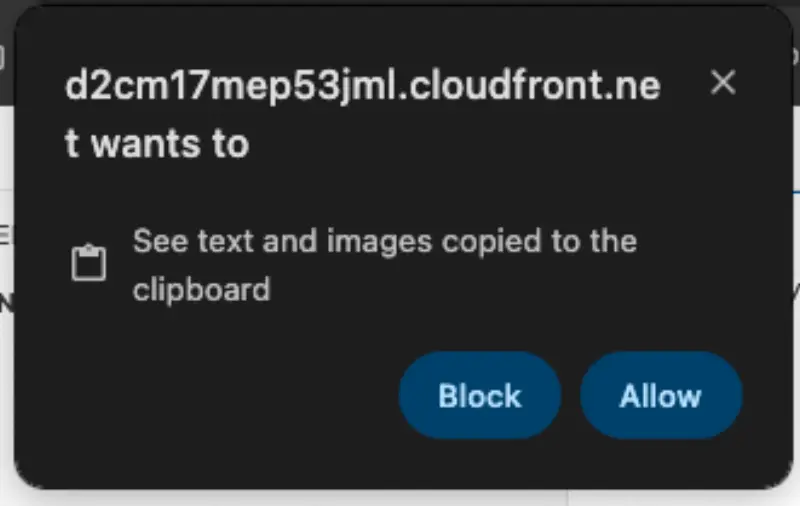

# 실습 탐색

이 웹사이트와 제공된 콘텐츠를 탐색하는 방법을 살펴보겠습니다.

### Structure

이 워크샵의 콘텐츠는 다음과 같이 구성되어 있습니다:

1. 개별 실습 과정
2. 실습과 관련된 개념을 설명하는 지원 콘텐츠

실습 과정은 모든 모듈을 독립적인 실습으로 실행할 수 있도록 설계되었습니다. 실습 과정은 왼쪽 사이드바에 표시되며 여기 보이는 아이콘으로 표시됩니다:


이 모듈에는 화면 왼쪽에 표시되는 '[**시작하기**](../undefined/index-1/)' 라는 단일 실습이 포함되어 있습니다


주의

각 실습은 이 배지로 표시된 페이지에서 시작해야 합니다. 실습 중간에서 시작하면 예측할 수 없는 동작이 발생할 수 있습니다.


브라우저에 따라 VSCode 터미널에 처음으로 내용을 복사/붙여넣기할 때 다음과 같은 프롬프트가 표시될 수 있습니다:



### 터미널 명령어


한국어 버전에서는 명령어만 복사하기가 동작하지 않습니다.&#x20;

명령어를 마우스로 Drag 한뒤, 복사하여 사용하세요.


워크샵에서 대부분의 상호작용은 터미널 명령어를 통해 이루어지며, IDE 터미널에 직접 입력하거나 복사/붙여넣기할 수 있습니다. 터미널 명령어는 다음과 같이 표시됩니다:

```bash
$ echo "This is an example command"
```

`echo "This is an example command"` 위에 마우스를 올리고 클릭하면 해당 명령어가 클립보드에 복사됩니다.&#x20;

다음과 같이 샘플 출력이 포함된 명령어도 보게 될 것입니다:

```bash
$ date
Fri Aug 30 12:25:58 MDT 2024
```

'click to copy' 기능을 사용하면 명령어만 복사되고 샘플 출력은 무시됩니다.

콘텐츠에서 사용되는 또 다른 패턴은, 단일 터미널에 여러 명령어를 표시하는 것입니다:

```bash
$ echo "This is an example command"
This is an example command
$ date
Fri Aug 30 12:26:58 MDT 2024
```

이 경우 각 명령어를 개별적으로 복사하거나 터미널 창 오른쪽 상단의 클립보드 아이콘을 사용하여 모든 명령어를 복사할 수 있습니다. 한번 시도해보세요!

### EKS 클러스터 초기화하기

실수로 클러스터를 제대로 작동하지 않는 방식으로 구성한 경우, 언제든지 실행할 수 있는 EKS 클러스터 초기화 메커니즘이 제공되어 있습니다. 단순히 `prepare-environment` 명령을 실행하고 완료될 때까지 기다리면 됩니다. 실행 시 클러스터의 상태에 따라 몇 분이 소요될 수 있습니다.

### 다음 단계

이제 이 워크샵의 형식에 익숙해졌으니, [시작하기](../undefined/index-1/) 실습으로 이동하거나 상단 네비게이션 바를 통해 워크샵의 어떤 모듈로든 건너뛸 수 있습니다.
